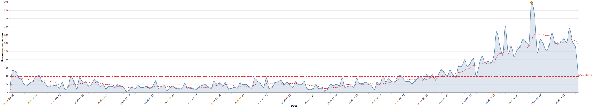

# Servers published summary

Generated on: 2026-02-25T09:04:08.9500228+00:00

## Quick facts
- Total records processed: 6769
- Total unique server names: 2537
- Date range: 2025-09-08 to 2026-02-25
- Peak day: 2026-02-22 with 148 unique server names
- Average unique server names per day: 27.13

## Top 5 busiest days
- 2026-02-22: 148 unique servers
- 2026-02-23: 118 unique servers
- 2026-02-24: 91 unique servers
- 2026-02-17: 88 unique servers
- 2026-02-21: 88 unique servers

## Unique server names by category

| Category | Unique Server Names | % of Total |
|----------|---------------------:|-----------:|
| npm | 1037 | 40.88% |
| remote | 763 | 30.07% |
| pypi | 443 | 17.46% |
| oci | 89 | 3.51% |
| none | 68 | 2.68% |
| mcpb | 46 | 1.81% |
| oci+pypi | 24 | 0.95% |
| npm+oci | 17 | 0.67% |
| nuget | 14 | 0.55% |
| mcpb+npm | 10 | 0.39% |
| npm+pypi | 8 | 0.32% |
| mcpb+pypi | 6 | 0.24% |
| mcpb+npm+oci | 4 | 0.16% |
| npm+nuget | 2 | 0.08% |
| nuget+oci+pypi | 1 | 0.04% |
| nuget+oci | 1 | 0.04% |
| npm+oci+pypi | 1 | 0.04% |
| mcpb+oci | 1 | 0.04% |
| mcpb+npm+nuget+oci+pypi | 1 | 0.04% |
| mcpb+npm+nuget | 1 | 0.04% |

## Top 20 domains by unique server names

| Domain | Unique Server Names | Categories |
|--------|---------------------:|------------|
| smithery.ai | 214 | remote |
| ansvar.eu | 76 | npm |
| dave-london.github.io | 26 | npm |
| nirholas.github.io | 19 | none, pypi |
| domdomegg.github.io | 18 | mcpb+npm, mcpb+npm+oci, npm, nuget, pypi |
| iowarp.github.io | 16 | pypi |
| asklokesh.github.io | 16 | pypi |
| thenextgennexus.github.io | 15 | npm |
| expertvagabond.github.io | 13 | npm |
| wmarceau.github.io | 12 | pypi |
| waystation.ai | 12 | remote |
| mcp.com.ai | 9 | oci, remote |
| staging.alpic.live | 8 | remote |
| shashwatgtm.github.io | 8 | npm |
| dpozimski.github.io | 8 | npm |
| verygoodplugins.github.io | 7 | npm, pypi |
| neverinfamous.github.io | 6 | npm+oci, oci, oci+pypi |
| microsoft.com | 6 | mcpb+npm+nuget, npm+nuget, nuget, remote |
| j0hanz.github.io | 6 | npm |
| houtini-ai.github.io | 6 | npm |
