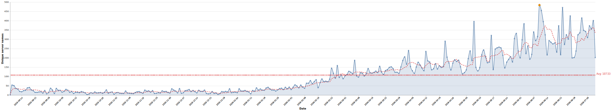

# Servers published summary

Generated on: 2026-04-17T21:02:46.5847057+00:00

## Quick facts
- Total records processed: 17627
- Total unique server names: 6256
- Date range: 2025-09-08 to 2026-04-17
- Peak day: 2026-04-03 with 241 unique server names
- Average unique server names per day: 53.45

## Top 5 busiest days
- 2026-04-03: 241 unique servers
- 2026-04-12: 241 unique servers
- 2026-04-01: 206 unique servers
- 2026-03-31: 189 unique servers
- 2026-03-06: 187 unique servers

## Unique server names by category

| Category | Unique Server Names | % of Total |
|----------|---------------------:|-----------:|
| npm | 2761 | 44.13% |
| remote | 1985 | 31.73% |
| pypi | 967 | 15.46% |
| oci | 145 | 2.32% |
| none | 116 | 1.85% |
| mcpb | 110 | 1.76% |
| oci+pypi | 43 | 0.69% |
| npm+oci | 40 | 0.64% |
| npm+pypi | 27 | 0.43% |
| nuget | 26 | 0.42% |
| mcpb+npm | 11 | 0.18% |
| mcpb+pypi | 7 | 0.11% |
| mcpb+npm+oci | 4 | 0.06% |
| npm+oci+pypi | 3 | 0.05% |
| mcpb+oci | 3 | 0.05% |
| npm+nuget | 2 | 0.03% |
| mcpb+npm+nuget+pypi | 2 | 0.03% |
| mcpb+npm+nuget+oci+pypi | 2 | 0.03% |
| nuget+oci+pypi | 1 | 0.02% |
| nuget+oci | 1 | 0.02% |

## Top 20 domains by unique server names

| Domain | Unique Server Names | Categories |
|--------|---------------------:|------------|
| smithery.ai | 214 | remote |
| pipeworx-io.github.io | 119 | remote |
| br0ski777.github.io | 100 | remote |
| ansvar.eu | 97 | npm |
| codespar.github.io | 57 | npm |
| ryudi84.github.io | 49 | npm |
| theyahia.github.io | 47 | npm |
| daedalus.github.io | 44 | pypi |
| olyport.com | 38 | remote |
| rog0x.github.io | 33 | npm |
| dave-london.github.io | 26 | npm |
| junct-bot.github.io | 24 | remote |
| nirholas.github.io | 22 | none, npm, pypi |
| cyanheads.github.io | 20 | npm |
| markswendsen-code.github.io | 19 | npm |
| domdomegg.github.io | 18 | mcpb+npm, mcpb+npm+oci, npm, nuget, pypi |
| therealmrfunguy.github.io | 17 | remote |
| ansvar-systems.github.io | 17 | npm, pypi, remote |
| microsoft.com | 16 | mcpb+npm+nuget+oci+pypi, mcpb+npm+nuget+pypi, npm+nuget, nuget, remote |
| mcpbundles.com | 16 | mcpb |
