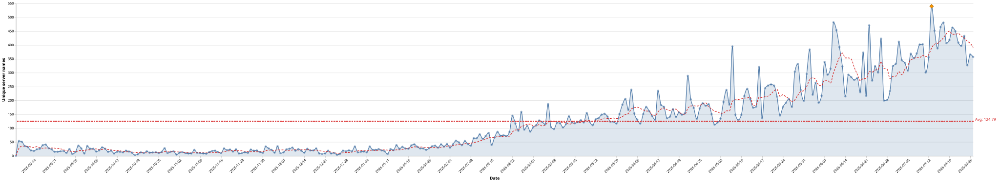

# Servers published summary

Generated on: 2026-08-03T07:53:39.3443880+00:00

## Quick facts
- Total records processed: 64529
- Total unique server names: 19784
- Date range: 2025-09-08 to 2026-08-03
- Peak day: 2026-07-13 with 540 unique server names
- Average unique server names per day: 131.66

## Top 5 busiest days
- 2026-07-13: 540 unique servers
- 2026-07-30: 530 unique servers
- 2026-07-27: 526 unique servers
- 2026-07-31: 502 unique servers
- 2026-06-10: 482 unique servers

## Unique server names by category

| Category | Unique Server Names | % of Total |
|----------|---------------------:|-----------:|
| remote | 8875 | 44.86% |
| npm | 6586 | 33.29% |
| pypi | 2766 | 13.98% |
| oci | 411 | 2.08% |
| mcpb | 347 | 1.75% |
| none | 333 | 1.68% |
| oci+pypi | 160 | 0.81% |
| nuget | 75 | 0.38% |
| npm+pypi | 63 | 0.32% |
| npm+oci | 62 | 0.31% |
| mcpb+npm | 27 | 0.14% |
| mcpb+pypi | 14 | 0.07% |
| mcpb+oci | 13 | 0.07% |
| cargo | 13 | 0.07% |
| npm+oci+pypi | 7 | 0.04% |
| npm+nuget | 7 | 0.04% |
| mcpb+npm+oci | 4 | 0.02% |
| cargo+oci | 4 | 0.02% |
| mcpb+oci+pypi | 3 | 0.02% |
| mcpb+npm+nuget+oci+pypi | 3 | 0.02% |
| mcpb+npm+nuget+pypi | 2 | 0.01% |
| nuget+oci+pypi | 1 | 0.01% |
| nuget+oci | 1 | 0.01% |
| npm+nuget+pypi | 1 | 0.01% |
| mcpb+nuget | 1 | 0.01% |
| mcpb+npm+pypi | 1 | 0.01% |
| mcpb+npm+oci+pypi | 1 | 0.01% |
| cargo+pypi | 1 | 0.01% |
| cargo+npm | 1 | 0.01% |
| cargo+mcpb | 1 | 0.01% |

## Top 20 domains by unique server names

| Domain | Unique Server Names | Categories |
|--------|---------------------:|------------|
| pipeworx-io.github.io | 1311 | remote |
| csoai-org.github.io | 305 | pypi |
| smithery.ai | 213 | remote |
| codespar.github.io | 126 | npm |
| wishpool.app | 125 | remote |
| cyanheads.github.io | 125 | npm |
| ansvar.eu | 106 | npm, remote |
| br0ski777.github.io | 101 | remote |
| usefulapi.io | 99 | remote |
| evozim.github.io | 99 | npm, remote |
| mcp-dir.github.io | 97 | remote |
| mcparmory.com | 76 | oci+pypi |
| nirholas.github.io | 69 | none, npm, pypi, remote |
| tooloracle.io | 61 | remote |
| srotzin.github.io | 60 | remote |
| servosity.github.io | 58 | mcpb |
| lazymac2x.github.io | 55 | npm, remote |
| wyre-technology.github.io | 54 | oci |
| chrischall.github.io | 52 | npm |
| rocnubie.github.io | 50 | none |
