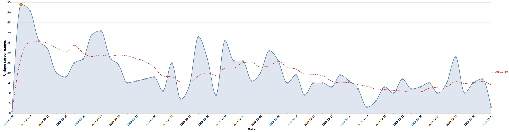

# Servers published summary

Generated on: 2025-09-15T17:29:55.8687947+00:00

## Quick facts
- Total records processed: 302
- Total unique server names: 211
- Date range: 2025-09-08 to 2025-09-15
- Peak day: 2025-09-09 with 55 unique server names
- Average unique server names per day: 29.25

## Top 5 busiest days
- 2025-09-09: 55 unique servers
- 2025-09-10: 51 unique servers
- 2025-09-11: 36 unique servers
- 2025-09-12: 33 unique servers
- 2025-09-13: 20 unique servers

## Unique server names by category

| Category | Unique Server Names | % of Total |
|----------|---------------------:|-----------:|
| remote | 97 | 45.97% |
| npm | 73 | 34.6% |
| pypi | 24 | 11.37% |
| oci | 6 | 2.84% |
| nuget | 5 | 2.37% |
| mcpb+npm+oci | 3 | 1.42% |
| mcpb | 2 | 0.95% |
| none | 1 | 0.47% |

## Top 20 domains by unique server names

| Domain | Unique Server Names | Categories |
|--------|---------------------:|------------|
| smithery.ai | 53 | remote |
| waystation.ai | 12 | remote |
| huoshuiai42.github.io | 5 | pypi |
| mintmcp.com | 4 | remote |
| bytedance.github.io | 4 | npm |
| ruvnet.github.io | 3 | npm |
| domdomegg.github.io | 3 | mcpb+npm+oci, nuget, pypi |
| cyanheads.github.io | 3 | npm |
| b1ff.github.io | 3 | npm |
| yuna0x0.github.io | 2 | mcpb+npm+oci |
| stefanoamorelli.github.io | 2 | npm, pypi |
| spences10.github.io | 2 | npm |
| shawndurrani.ai | 2 | npm, remote |
| shalevshalit.github.io | 2 | npm |
| joelverhagen.github.io | 2 | nuget |
| jkakar.github.io | 2 | none, npm |
| henilcalagiya.github.io | 2 | pypi |
| formulahendry.github.io | 2 | npm |
| zine.ai | 1 | remote |
| zhongweili.github.io | 1 | pypi |
